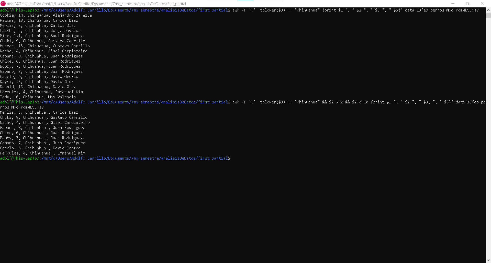
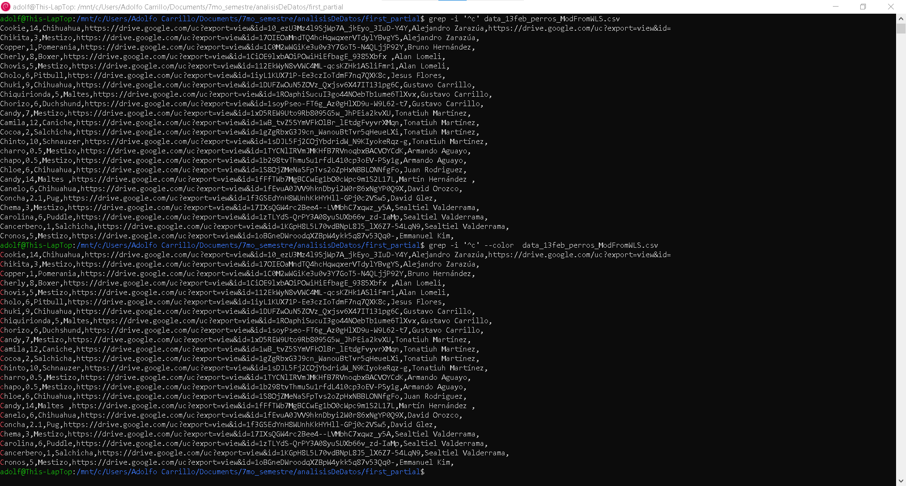
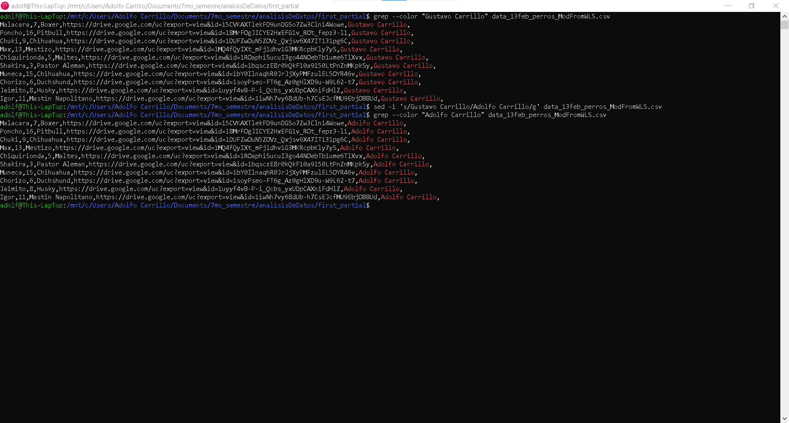
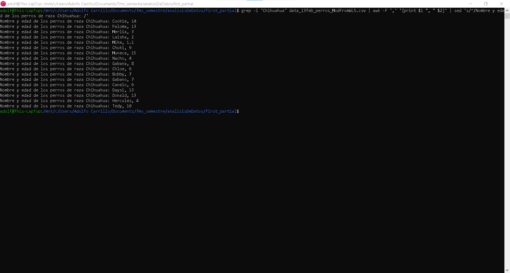
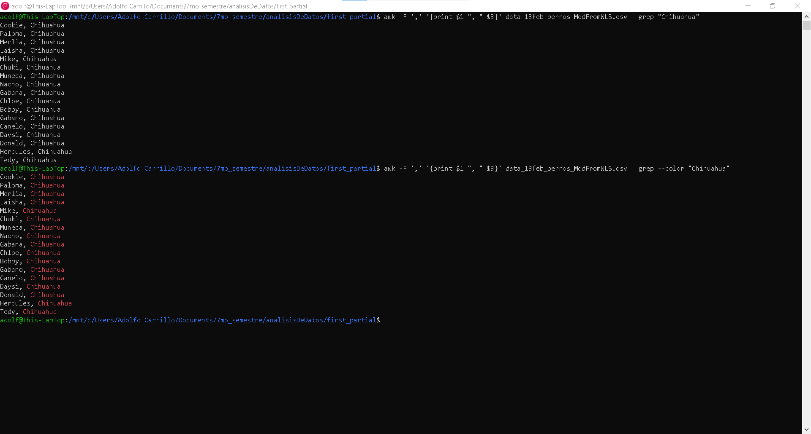

# Second activity_22feb2023

#### This is the second activity on data analysis related with the usage of AWK, Grep and Sed command in windows. ####

***The next image shows the command AWK in execution on the CLI on Debian***



The awk command is a versatile text processing tool that is commonly used in Unix-based systems. It is used to process and manipulate text data, such as selecting specific columns or fields, calculating statistics, and performing string operations.

Here is a basic syntax for using the awk command:
```
awk '[pattern] {action}' [file(s)]
```
In this syntax:

awk is the command itself.
[pattern] is an optional regular expression that specifies which lines to process. If it is not specified, all lines will be processed.
{action} is a set of one or more commands to perform on the lines that match the pattern. If it is not specified, the default action is to print the entire line.
[file(s)] are the file or files to process. If no files are specified, awk will read from standard input.

<br>

***The next image shows the command Grep in execution on the CLI on Debian***



The grep command is a powerful text search tool that is commonly used in Unix-based systems. It is used to search for a specified pattern or regular expression in one or more files.

Here is a basic syntax for using the grep command:

```
grep [options] pattern [file(s)]
```
In this syntax:

grep is the command itself.
[options] are optional command-line options that modify the behavior of the command. There are many options available; some commonly used ones include -i (ignore case), -r (recursively search subdirectories), and -v (invert the match to show non-matching lines).
pattern is the regular expression or string to search for.
[file(s)] are the file or files to search in. If no files are specified, grep will read from standard input.
<br>

***The next image shows the command Sed in execution on the CLI on Debian***



The sed command is a powerful tool for editing and transforming text. It allows you to perform operations like search and replace, delete, insert, and more on a file or standard input stream. The basic syntax for using sed is:

```
sed [OPTIONS] [SCRIPT] [INPUTFILE]
```

Here are some common options used with sed:

-i: Edit the file in place (i.e., modify the file directly).
-e: Specifies a script to be executed.
-n: Suppresses the default output.
-r: Enables extended regular expressions.
And here are some basic sed commands:

s: Substitute one string for another.
d: Delete lines that match a pattern.
p: Print lines that match a pattern.
a: Append text after a line.
i: Insert text before a line.

<br>

***The following image shows a combination of the command AWK, Grep and Sed in execution on the CLI on Debian***



<br>

***The following image shows a combination of the command AWK, Grep and Sed in execution on the CLI on Debian***


